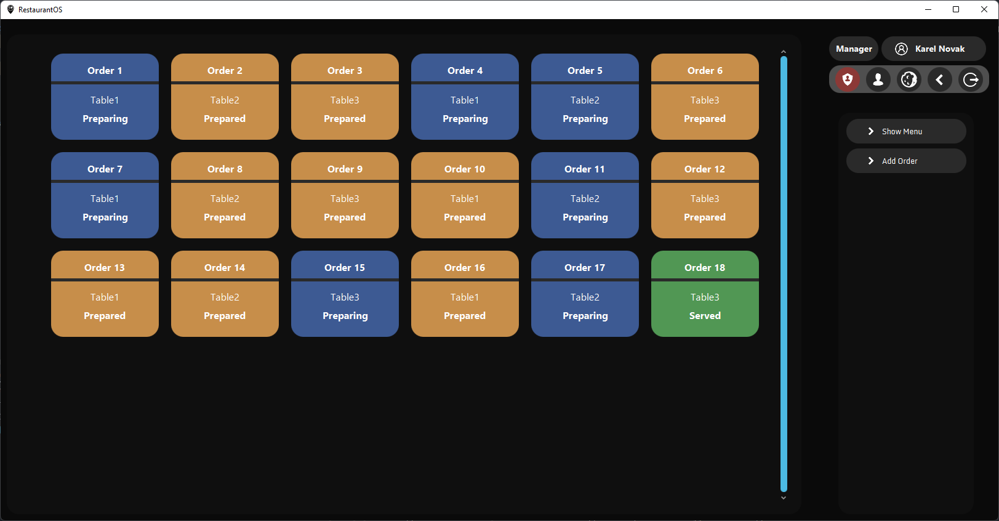

  

<h3 align="center">RestaurantOS</h3>

  Made as School project
   
  <a href="https://github.com/sobotat/RestaurantOS/issues">Report bug</a>
  ·
  <a href="https://github.com/sobotat/RestaurantOS/discussions/categories/q-a">Questions</a>
  · 
  <a href="https://github.com/sobotat/RestaurantOS/releases/latest">Download</a>

---
### Info

Application was made only for school purpose.

---
### UI

---
### Install
    📢 It will warn you that the software is unsafe. This is because it has no certificate.
       (Too expensive for a student's life)

1. Download **exe** or **msi** file <a href="https://github.com/sobotat/RestaurantOS/releases/latest">📄 From Here</a>
2. Install it and you are ready to use.

---
### Work to need to be done

- Make App Better

---
### Ideas or Bugs

It's like with any software. I'll be glad for any reported bugs, and I'll also be glad for ideas on how to improve the application.

🛠️ You can report a bug <a href="https://github.com/sobotat/SE_Trader/issues">Here</a>  
⭐ Here you can tell about your idea <a href="https://github.com/sobotat/SE_Trader/discussions/categories/ideas">Here</a>

---
### Changelog

    

Show

    - 0.0.1
      - Working Login
      - Working Order List and Order View
      - Inprogress Users View
      - Working Manager Auth
    - 0.1
      - Implemented Dark Mode
      - Implemented Automatic Order Status
    - 0.2
      - Implemented Gateways with Lists for now

